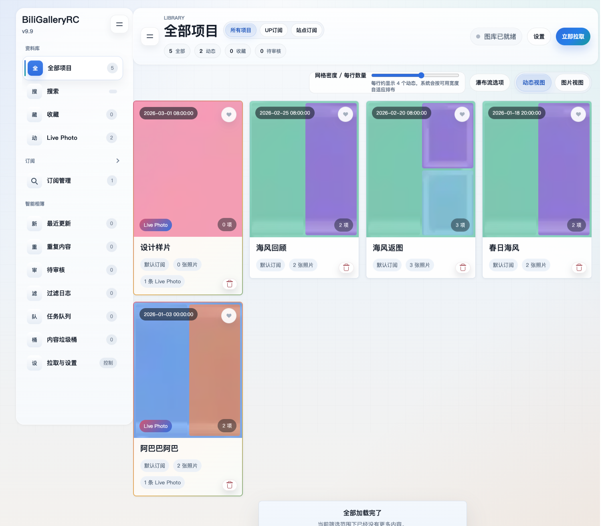
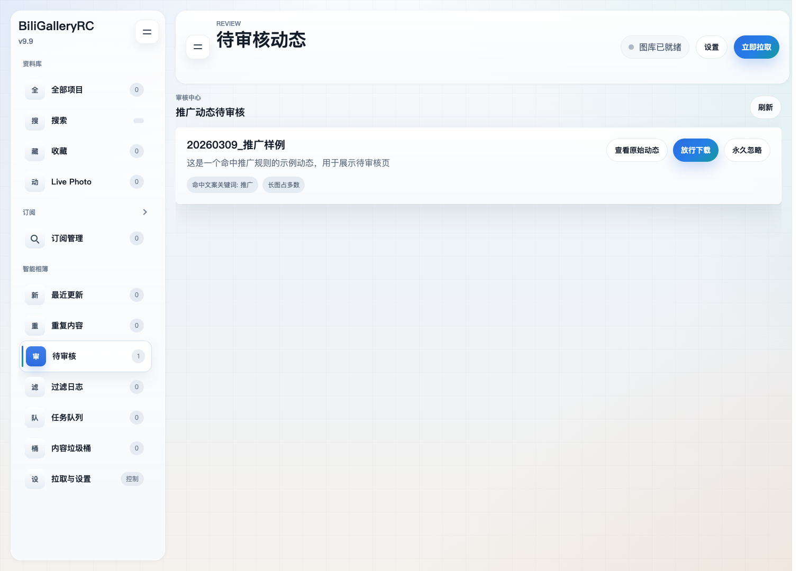
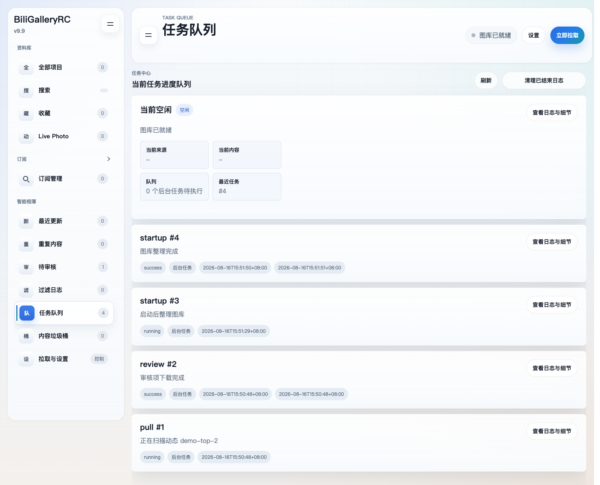

# B 站动态相簿 BiliGalleryRC

BiliGalleryRC v9.9 是一个面向个人收藏场景的 B 站动态相簿。它负责把动态图片与 Live Photo 整理到本地图库，并提供浏览、筛选、审核和后台维护能力；Web 应用位于 <code>docker_app/</code>，也可通过 Docker Compose 部署到 AMD64 NAS。

## 功能特性

- **动态与媒体采集**：支持 B 站九图动态和 Live Photo 拉取，保留动态正文、发布时间及来源信息；根目录的 <code>bili_9pics_downloader.py</code> 与 <code>LivePhoto/</code> 目录保留对应的采集脚本。
- **相簿浏览**：按动态或图片视图浏览图库，支持按时间、年份、月份、来源类型和订阅筛选；可按标题、正文或订阅源搜索，并将动态加入收藏。
- **最近更新**：把近期新增内容按动态聚合，直接查看本次同步带来的文件、图片和 Live Photo 变化。
- **重复检测**：对图库图片进行相似内容检测，支持查看重复组、忽略重复组、选择保留项，以及将不需要的动态放入垃圾桶。
- **审核与过滤**：对命中过滤规则的动态进入待审核列表，并保留过滤日志；审核项可以查看原始动态、放行下载或永久忽略。关键词和长图等规则可在设置中调整。
- **任务队列**：拉取、审核下载、校验、页面索引、缩略图重建、重复内容处理、垃圾清理和站点同步等工作统一进入任务中心，可查看进度和日志，支持暂停、继续、取消与重试。
- **订阅与站点源**：管理 B 站 UP 主订阅和外部站点订阅；站点源支持 RSS、Sitemap 或 HTML 列表页，并可配置定时同步、筛选规则和网络代理。
- **登录与运行控制**：支持 B 站二维码登录、Cookie 状态检查和退出登录；可以配置定时拉取间隔、站点同步间隔及过滤关键词。
- **缩略图与性能调度**：为原图生成 tiny、small、thumb 等分级缩略图，配合页面按需加载和本地索引；前台浏览拥有更高优先级，后台拉取、清理、索引和重复检测会主动让行。

## 效果展示

以下图片均由 <code>docker_app/scripts/seed_review_data.py</code> 生成隔离的占位图片、视频和 SQLite 数据后截取。它们不读取仓库中的 <code>storage/</code>，也不包含真实账号、二维码、订阅或外部服务内容。

图库首页展示动态卡片、Live Photo 标记、收藏入口、来源筛选和智能相簿导航。

查看器支持上一张、下一张、删除和关闭等操作；图中媒体为占位图片。

待审核页面展示命中过滤规则的示例动态，可选择查看原始动态、放行下载或永久忽略。

任务队列集中显示当前状态、后台任务、时间和日志详情入口。

## 部署指导（Docker Compose）

> **提示**：如果你不熟悉 Docker 或不想处理部署细节，可以将本项目地址发送给你的 Agent，请它协助完成部署。

### 源码构建启动

需要 Docker Engine 和 Docker Compose v2。命令从仓库根目录执行：

~~~bash
mkdir -p storage/config storage/data
docker compose -f docker_app/docker-compose.example.yml up -d --build
~~~

应用启动后访问 <http://localhost:7860>。源码 Compose 文件会把仓库挂载到容器 <code>/workspace</code>，运行时数据保存在仓库的 <code>storage/</code> 下。

常用运维命令：

~~~bash
# 查看容器状态
docker compose -f docker_app/docker-compose.example.yml ps

# 查看最近 200 行日志并持续跟踪
docker compose -f docker_app/docker-compose.example.yml logs -f --tail=200

# 升级源码并重新构建
git pull
docker compose -f docker_app/docker-compose.example.yml up -d --build

# 停止并移除容器（不会删除 storage/）
docker compose -f docker_app/docker-compose.example.yml down
~~~

Compose 中的关键环境变量如下：

| 变量 | 默认示例 | 作用 |
| --- | --- | --- |
| <code>APP_REPO_ROOT</code> | <code>/workspace</code> | 容器内仓库根目录，供采集脚本和旧数据导入使用 |
| <code>APP_STORAGE_ROOT</code> | <code>/workspace/storage</code> | 应用运行时数据根目录 |
| <code>APP_THUMBNAIL_WORKERS</code> | <code>1</code> | 缩略图后台处理并发数，NAS 可按资源情况调整 |
| <code>APP_SECRET_KEY</code> | 未设置时使用内置开发默认值 | 可选的应用密钥；长期部署或对外开放时请设置自定义值 |
| <code>TZ</code> | <code>Asia/Shanghai</code> | 容器时区，影响任务时间和动态显示时间 |

### AMD64 NAS 使用预构建镜像

v9.9 的 AMD64 镜像包不纳入 Git 工作树。请从[项目 Releases 页面](https://github.com/JDui/bili-gallery/releases)或其他正式发布交付物取得对应版本的 tar 包和 <code>.sha256</code> 校验文件；页面上的版本和资产名称以实际发布内容为准。将取得的镜像包和 <code>docker_app/docker-compose.nas-amd64.yml</code> 复制到 NAS 后，在部署目录执行：

~~~bash
sha256sum -c zzs-bili-gallery_v9.9_amd64.tar.sha256
docker load -i zzs-bili-gallery_v9.9_amd64.tar
docker image inspect zzs-bili-gallery:9.9-amd64 --format '{{.Id}}'
~~~

启动前必须编辑 <code>docker_app/docker-compose.nas-amd64.yml</code> 的 <code>volumes</code>。文件中的示例宿主机路径是占位配置，请改成 NAS 上真实、可写的目录，并保留容器目标路径：

~~~yaml
volumes:
  - /your/nas/path/bili-gallery/config:/storage/config
  - /your/nas/path/bili-gallery/data:/storage/data
~~~

<code>/storage/config</code> 至少保存 <code>app.db</code>，<code>/storage/data</code> 保存图片、Live Photo、缩略图和其他运行时媒体。升级镜像时不要删除这两个宿主机目录。

确认路径后，从仓库根目录启动：

~~~bash
docker compose -f docker_app/docker-compose.nas-amd64.yml up -d
docker compose -f docker_app/docker-compose.nas-amd64.yml ps
docker compose -f docker_app/docker-compose.nas-amd64.yml logs -f --tail=200
~~~

NAS Compose 已将容器端口 <code>7860</code> 映射到宿主机 <code>7860</code>，访问地址为 <code>http://NAS地址:7860</code>。之后的停止、重启和升级命令：

~~~bash
# 停止并移除容器，保留宿主机数据卷
docker compose -f docker_app/docker-compose.nas-amd64.yml down

# 载入新 tar 后重建容器
docker load -i zzs-bili-gallery_v9.9_amd64.tar
docker compose -f docker_app/docker-compose.nas-amd64.yml up -d
~~~

NAS Compose 使用 <code>APP_REPO_ROOT=/workspace</code>、<code>APP_STORAGE_ROOT=/storage</code>、<code>APP_THUMBNAIL_WORKERS=1</code> 和 <code>TZ=Asia/Shanghai</code>。如果改动了环境变量或宿主机路径，重新执行 <code>up -d</code> 即可让 Compose 重建容器。

## 开发信息

### 目录与架构

~~~text
.
├── bili_9pics_downloader.py        # B 站九图动态采集
├── LivePhoto/                      # Live Photo 采集脚本与记录
├── docker_app/
│   ├── app/                        # FastAPI、SQLite、采集/同步/图库服务
│   ├── app/templates/              # Jinja2 页面模板
│   ├── app/static/                 # Alpine.js、原生 JavaScript 与 CSS
│   ├── rust/                       # indexer 与 media-worker Rust sidecar
│   ├── scripts/                    # 启动、占位数据和页面截图脚本
│   ├── tests/                      # Python 测试
│   ├── Dockerfile
│   └── docker-compose*.yml
└── storage/                        # 本地运行时数据，不纳入版本控制
~~~

应用后端使用 Python 3.12、FastAPI、Uvicorn、Jinja2、SQLite、APScheduler、Pillow、Requests、BeautifulSoup/lxml 和 qrcode；前端使用 Jinja2 模板、原生 JavaScript、CSS 及仓库内置的 Alpine.js；媒体探测、索引和部分后台工作由 <code>docker_app/rust/</code> 中的 Rust sidecar 辅助。

运行时目录约定为：

- <code>storage/config/app.db</code>：配置、任务、订阅、审核、过滤日志和图库索引。
- <code>storage/data/images/</code>：普通图片及其缩略图。
- <code>storage/data/livephoto/</code>：Live Photo 视频、封面和缩略图。
- <code>storage/data/</code> 下的其他目录：头像、缓存和应用维护数据。

### 本地开发与测试

~~~bash
cd docker_app
python3 -m venv .venv
. .venv/bin/activate
pip install -r requirements.txt
PYTHONPATH=. APP_REPO_ROOT=.. APP_STORAGE_ROOT=../storage \
  uvicorn app.main:app --host 127.0.0.1 --port 7860
~~~

在另一个终端运行测试：

~~~bash
cd docker_app
PYTHONPATH=. .venv/bin/pytest -q
~~~

页面审查截图使用隔离占位数据。<code>review_capture.sh</code> 当前针对 macOS 的 Lima Docker 流程：需要本机已有可运行的 <code>limactl</code>、Lima 的 <code>lima-docker</code> context、Docker、Playwright 浏览器和审查镜像；脚本会在 <code>docker_app/review/&lt;时间戳&gt;/</code> 下生成临时运行目录与截图：

~~~bash
bash docker_app/scripts/review_capture.sh zzs-bili-gallery:9.9-amd64
~~~

脚本内部调用 <code>seed_review_data.py</code>，不会读取真实 <code>storage/</code>。如果只需要生成占位数据库和媒体，可单独执行：

~~~bash
docker_app/.venv/bin/python docker_app/scripts/seed_review_data.py \
  --storage-root /tmp/bili-gallery-review
~~~

当前应用版本由 <code>docker_app/app/version.py</code> 中的 <code>APP_VERSION = "9.9"</code> 定义；对应 NAS 镜像标签为 <code>zzs-bili-gallery:9.9-amd64</code>，镜像包文件名为 <code>zzs-bili-gallery_v9.9_amd64.tar</code>。
